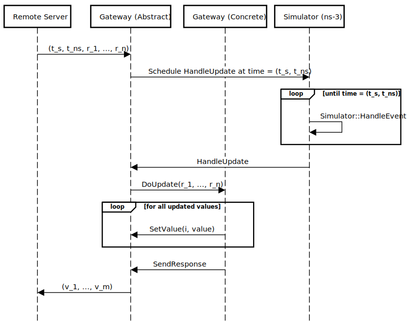

# Co-Simulation of ns-3 Network Models

This repository contains software that enables the co-simulation of ns-3 network models with other simulation software.
Co-simulation is a modeling and simulation technique to develop high-fidelity simulations through the integration and
joint operation of multiple simulators running in parallel. A co-simulation requires middleware (this repository) to
define a shared time reference and the mechanisms for data exchange between simulators.

For a practical example, [Simulation of Urban Mobility (SUMO)](https://eclipse.dev/sumo/) is a popular traffic simulator
that can model transportation networks of on-road vehicles. An ns-3 model for vehicle-to-vehicle communications could
let SUMO handle node mobility rather than trying to implement its own approach to vehicle motion. This allows ns-3 to
focus on just the communication network, with any domain-specific functionality outsourced to specialized simulators
such as SUMO. In a co-simulation, the integration between ns-3 and SUMO is online where both simulators run in parallel
with periodic synchronization at runtime for data exchange. This is more dynamic than offline approaches that exchange
pre-recorded data, as the performance of the communications network in ns-3 can affect the on-going traffic simulation
in SUMO and vice versa.

The following new classes are provided:
  - a [gateway](model/gateway.h) for integrating ns-3 with other software using a local TCP/IP socket connection
  - a [triggered send application](model/triggered-send-application.h) that lets external code broadcast messages
  - an [external mobility model](model/external-mobility-model.h) that lets external code manage ns-3 node mobility

# Gateway Architecture

The gateway is an abstract class with two pure virtual functions (`Gateway::DoInitialize` and `Gateway::DoUpdate`). It
maintains a TCP/IP socket connection to a remote server, defines a simple string-based application layer protocol for
data exchange, and synchronizes the ns-3 simulation time with time values received from the remote server.

A brief introduction to the gateway architecture is presented in the sections below. Before using the gateway, refer to
its [documentation](model/gateway.h) and the simple gateway example introduced later in this document.

## Data Exchange

The following sequence diagram shows how a single message is processed:

The remote server sends a message to the gateway. This message is a string, with the format:

    time(seconds),time(nanoseconds),received_value_1,...,received_value_n;

This message contains two delimiters: a field delimiter (`,`) that separates the values, and a message delimiter (`;`)
that indicates the end-of-message. These delimiters are the C++ `std::string` type and are configured when the gateway
is constructed. The default values are a space (for the field) and `\r\n` (for the message).

The `time(seconds)` and `time(nanoseconds)` values are considered the message header, and are stripped from the message
before any further processing. These values represent the seconds component (signed 32-bit integer) and the nanoseconds
component (unsigned 32-bit integer in the range [0,10e9)) of a single time value. This format was selected to match
the Robot Operating System (ROS2) [Time](https://docs.ros2.org/latest/api/builtin_interfaces/msg/Time.html) format.

When the gateway receives a new message, it schedules the `Gateway::HandleUpdate` function to be executed at the
`ns3::Time` equivalent of the message header. This handle update function delegates processing the message to the
user-defined `DoUpdate` function. The rest of the sequence diagram is a suggested implementation of `DoUpdate`.

The gateway will send a response when `Gateway::SendResponse` is called. This message is a string, with the format:

    value_1,value_2,...,value_m;

This message re-uses the same field delimiter (`,`) and end-of-message delimiter (`;`) as above. It will always contain
`m` values, where `m` is specified in the gateway constructor. Unless otherwise set, these values will default to an
empty string. The individual values can be set using the `Gateway::SetValue` function. Once set, each element retains
its value between consecutive calls to `Gateway::SendResponse`.

## Time Management

This section gives a coarse summary of the elements of time management relevant to using the gateway.

When `Gateway::Connect` is called, ns-3 time progression is immediately paused at the current simulation time forever.
The function `Gateway::WaitForNextUpdate` is scheduled to execute now, and this function recursively schedules itself
to execute now (forever). Time progression cannot resume until the scheduled `WaitForNextUpdate` event is cancelled.

When the gateway receives a new message from the remote server (see Data Exchange above), it cancels the currently
scheduled `WaitForNextUpdate` event and re-schedules it to execute at the time indicated in the received time stamp.
This allows ns-3 to simulate up to the time of the last received message, after which time progression will once again
pause until a new time stamp is received. This creates a leader-follower approach to time synchronization, where the
remote server acting as the leader controls ns-3 time progression through the sending of time stamped messages.

Note that, when implementing a remote server, the gateway operates on time relative to the first received time stamp.
Suppose that `Gateway::Connect` is called at an ns-3 simulation time of 5 seconds, and the first received message from
the remote server has the time stamp (10 seconds, 0 nanoseconds). This first message received from the remote server is
used to initialize the gateway, and does not cancel the `WaitForNextUpdate` event. If the next message received from
the remote server has a time stamp of (11 seconds, 0 nanoseconds), ns-3 will compute the time difference between the
time stamps and advance 1 second to an internal ns-3 simulation time of 6 seconds.

Until this documentation is revised with additional detail on time management, the simple gateway example is a good
reference to better understand time management.

# Installation

This code was developed for an ns-3 fork that supports vehicle-to-everything (V2X) communications, which is co-located
with the ns-3 [3GPP NR module](https://gitlab.com/cttc-lena). This code was not tested with, and may not support,
other versions of ns-3 (including the official releases).

## Requirements

This code was tested using:
  - Ubuntu 22.04
  - [ns-3-dev-v2x-v1.1](https://gitlab.com/cttc-lena/ns-3-dev/-/tree/ns-3-dev-v2x-v1.1)
  - [nr-v2x-v1.1](https://gitlab.com/cttc-lena/nr/-/tree/v2x-1.1)
  - [netsimulyzer-v1.0.13](https://github.com/usnistgov/NetSimulyzer-ns3-module/tree/v1.0.13)

These instructions require:
  - cmake 3.13 (or newer)
  - g++ 10.5.0 (or newer)
  - git (any version)
  - make (any version)
  - python 3.8 (or newer)

## Download Dependencies

Run the following commands, ignoring any comments (lines starting with #):

    # install the dependencies for the ns-3 NR module
    apt install libc6-dev libeigen3-dev sqlite sqlite3 libsqlite3-dev

    # download the custom ns-3 development branch for V2X communications
    git clone --branch ns-3-dev-v2x-v1.1 https://gitlab.com/cttc-lena/ns-3-dev.git
    
    # download additional ns-3 modules
    cd ns-3-dev/contrib
    git clone https://github.com/usnistgov/ns3-cosim.git

    # optional (for V2X examples using sidelink)
    git clone --branch v2x-1.1 https://gitlab.com/cttc-lena/nr.git
    # optional (for visualization of network models)
    git clone --branch v1.0.13 https://github.com/usnistgov/NetSimulyzer-ns3-module netsimulyzer

Ensure the directory structure matches, exactly:

    ns-3-dev
     - contrib
      - netsimulyzer
      - nr
      - ns3-cosim

## Compile ns-3

From the ns-3-dev directory, run:

    ./ns3 configure --enable-tests --enable-examples

Verify that the output under `Modules configured to be built:` includes `ns3-cosim`.

From the same ns-3-dev directory, run:

    ./ns3 build

# Examples

All examples must be run from the root `ns-3-dev` directory, which is not the directory where this README is located.

## External Mobility Example

The [external mobility example](examples/external-mobility-example.cc) shows how to set the position and velocity of
the new external mobility model. It can be run with the command:

    ./ns3 run external-mobility-example

This example contains two nodes. A periodic function is scheduled to update the mobility of each node. When a mobility
model is updated, its current position and velocity information is output to the ns-3 logger. The updates are:
  - Node 0 is updated every 2 seconds to increase the x-dimension of its position and velocity by 1.
  - Node 1 is updated every 1 second to increase the z-dimension of its position and velocity by 1.

## Triggered Send Example

The [triggered send example](examples/triggered-send-example.cc) shows how to start sending messages using the new
triggered send application, and its behavior when triggered under different conditions. It can be run with the command:

    ./ns3 run triggered-send-example

This example contains two nodes connected by a point-to-point channel. The first node (`192.168.0.1`) is a client with
a triggered send application, and the second node (`192.168.0.2`) is a server with a packet sink application. The first
node is triggered to send messages to the packet sink at different times during the simulation. When the packet sink
receives these messages, it outputs the current time to the ns-3 logger.

The `TriggeredSendApplication::Send` function takes the number of packets to send as an argument. The application also
has a `PacketInterval` attribute that specifies the time delay between sending two consecutive packets. In this example,
the client attempts to send 5 packets with a 200 ms packet interval. Refer to the code for the 4 different cases shown
in this example, and why in some cases the client doesn't send all 5 packets.

## Simple Gateway

This example shows how to create a simple gateway to communicate with external code. It consists of an ns-3 model that
implements the [gateway](examples/simple-gateway.cc) and a simple server that represents the
[external code](examples/simple-gateway-server.cc).

First, run the simple server:

    ./ns3 run simple-gateway-server

Then, run the ns-3 model in a separate terminal:

    ./ns3 run simple-gateway

The server by default runs a 20 time step simulation of 3 vehicles, where the position and velocity information for the
vehicles are randomized each step. Every 5 time steps (starting at step 6), the vehicles have a chance to broadcast a
message to the network. The server starts at time 0, with a step size of 1 second.

The ns-3 model contains 3 nodes to represent the vehicles, and the gateway implementation. Each node has an external
mobility model, a triggered send application for sending packets, and a packet sink for receiving packets. The gateway
implementation connects to the simple server, and uses the position and velocity information received from the server
to update the external mobility models. When the server indicates one of the vehicles has started broadcasting, the
gateway triggers the corresponding triggered send application. When a packet sink receives a packet, it outputs the
current simulation time to the ns-3 logger.

This example includes command line arguments to adjust the behavior of the server and the gateway. To specify the
command line arguments (and to see the list of possible arguments), use the format:

    ./ns3 run "simple-gateway --help"
    ./ns3 run "simple-gateway-server --help"
    ./ns3 run "<program_name> --<option_name>=<value>"

# Additional Information

## Third-Party Licenses

This repository includes modified ns-3 source code distributed under the GNU General Public License, Version 2.
All modified files include their original attributions in a comment header, and their respective licensing statements
can be found in the [LICENSES](LICENSES/) directory.

## Contact Information

This repository is maintained by:
  - Thomas Roth (@tpr1)

## Citation Information

You can cite this software in technical publications as:

`Thomas Roth (2025), Gateway for Co-Simulation using ns-3, National Institute of Standards and Technology, https://doi.org/10.18434/mds2-3738`

## References

ns-3 NR module
: https://gitlab.com/cttc-lena/nr

ns-3 NetSimulyzer module
: https://github.com/usnistgov/NetSimulyzer-ns3-module

NetSimulyzer standalone
: https://github.com/usnistgov/NetSimulyzer
